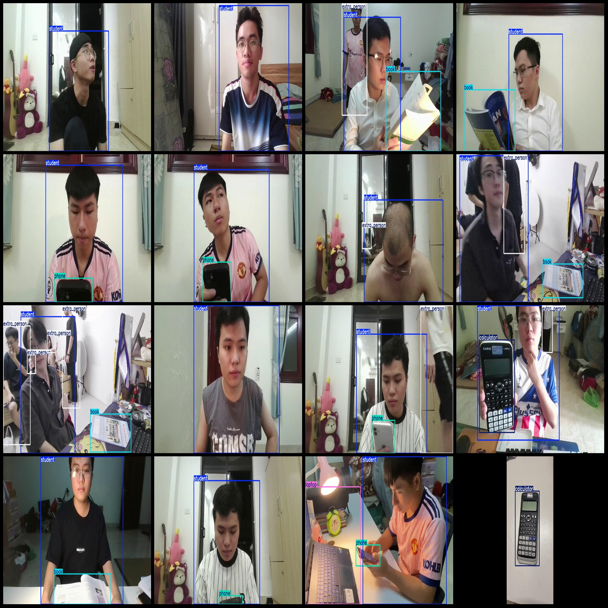
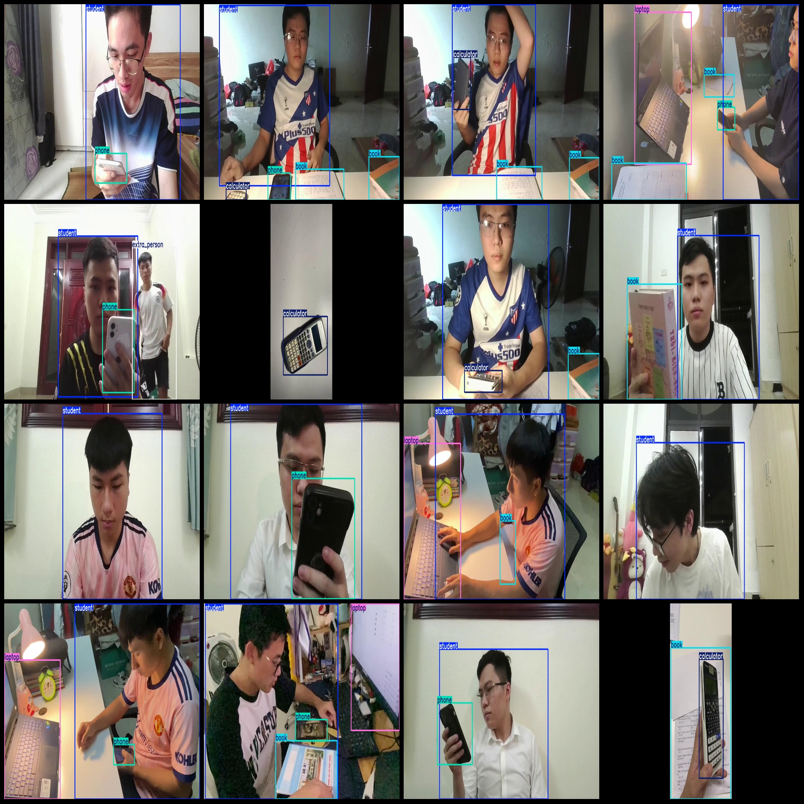

# Online Examination Cheating Detection Data Set with 53,51 Images in VOC+YOLO Format and 6 Categories

Note: The dataset contains multiple frames simulated from video segments. Due to the repetition of consecutive frames, which are not repeated but caused by clipping continuous frames, please pay attention to the image preview.
Dataset format: Pascal VOC format + YOLO format (txt file without segmentation path, only containing jpg images and corresponding VOC format xml files and yolo format txt files).
Number of images (jpg file count): 5351
Number of labels (xml file count): 5351
Number of labels (txt file count): 5351
Number of label categories: 6
Label category names in the txt file (notice that the order of the labels in the yolo format does not correspond with this, but is based on the "labels" folder's "classes.txt"): ["book", "calculator", "extra_person", "laptop", "phone", "student"]
Box numbers for each category:
book (box number) = 2323
calculator (box number) = 762
extra_person (box number) = 1197
laptop (box number) = 1188
phone (box number) = 2138
student (box number) = 4954
Total box numbers: 12562
Number of images per category:
book (image count) = 1782
calculator (image count) = 761
extra_person (image count) = 980
laptop (image count) = 1107
phone (image count) = 2135
student (image count) = 4946
Image resolution: 1280x720
Annotation tool used: labelImg
Annotation rule: draw a rectangle around the category
Important note: The dataset does not have separate training, validation, or test sets; you need to divide them yourself.
Special declaration: This dataset does not guarantee the accuracy of the trained model or weight files.
Image preview:
## Images

Here is a pay link on Stripe ( https://buy.stripe.com/3cs8yP7sY87d0vu9AB ). Please contact me lonlonago@foxmail.com after funding $89, and I will send you a complete data files , thank you!

